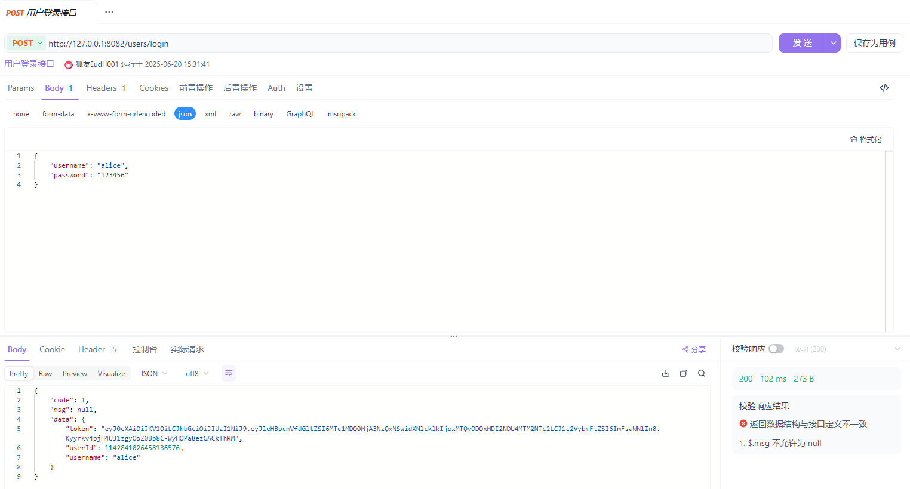
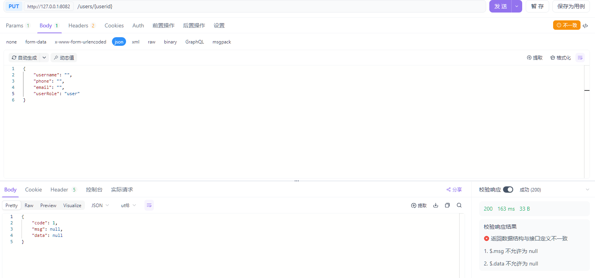

# 自测文档

> 项目：简化版用户权限管理系统  日期：2025-06-18

---

## 1. 测试用例

| 用例编号 | 场景               | 前置条件 / 输入                           | 期望结果 |
| -------- | ------------------ | ----------------------------------------- | -------- |
| TC-01    | 用户注册（合法）   | {     "username": "alice",     "password": "123456",     "phone": "123456789012",     "email": "v9bmdm.skj@hotmail.com" } | HTTP 200，返回 userId & token，`users_*` 与 `user_roles` 各插入 1 行 |
| TC-02    | 用户注册（非法）   | {     "username": "",     "password": "123456",     "phone": "123456789012",     "email": "v9bmdm.skj@hotmail.com" } | HTTP 400，返回字段校验失败信息 |
| TC-03    | 用户登录（成功）   | {     "username": "alice",     "password": "123456" } | HTTP 200，返回 token |
| TC-04    | 用户登录（密码错误） | {     "username": "alice",     "password": "12345" } | HTTP 401，返回 "用户名或密码错误" |
| TC-05    | 普通用户查看自己   | Header Authorization=用户 token           | HTTP 200，仅返回本人信息 |
| TC-06    | 未登录查看自己     | 无 Authorization Header                  | HTTP 401，返回 "未认证" |
| TC-07    | 管理员分页查看普通用户 | Header Authorization=管理员 token，省略 page,pageSize | HTTP 200，返回用户列表（使用默认第 1 页 / 10 条） |
| TC-08    | 普通用户越权获取他人信息 | Header Authorization=用户 token GET /users/{otherId} | HTTP 200，返回 result.code!=0 & msg="权限不足" |
| TC-09    | 超管查看所有用户   | Header Authorization=超管 token           | HTTP 200，返回全量列表 |
| TC-10    | 超管升级用户为管理员 | PUT /users/{userId} Header=超管 token Body: {"userRole":"admin"} | HTTP 200 |
| TC-11    | 超管降级管理员为用户 | PUT /users/{adminId} Header=超管 token Body: {"userRole":"user"} | HTTP 200，`user_roles.role_id=2` |
| TC-12    | 管理员越权修改他人角色 | PUT /users/{userId} Header=管理员 token Body: {"userRole":"admin"} | HTTP 200，返回 result.code!=0 & msg="无权限修改用户权限" |
| TC-13    | 事务回滚（异常）   | 停止 permission-service 后执行注册        | HTTP 500；数据库无脏数据 |
| TC-14    | MQ 日志消费        | 任意成功业务请求                          | RabbitMQ queue 无堆积，`logging.operation_logs` 增加 1 行 |
| TC-15    | 水平分片验证       | 连续插入 4 个不同 user_id（雪花算法）      | `users_0/1` 表均有数据，路由正确 |

---

## 2. 测试结果

| 用例编号 | 执行结果 | 关键截图 / SQL 片段 |
| -------- | -------- | ------------------- |
| TC-01    | ✅ Pass  |  |
| TC-02    | ✅ Pass  |  |
| TC-03    | ✅ Pass  | 返回 JWT 长度 > 100 字符! |
| TC-04    | ✅ Pass  |  |
| TC-05    | ✅ Pass  | 列表长度 = 1 |
| TC-06    | ✅ Pass  | HTTP 401 |
| TC-07    | ✅ Pass  | 列表长度 ≥ 3，page=1，size=10 |
| TC-08    | ✅ Pass  | 错误消息 = "权限不足" |
| TC-09    | ✅ Pass  | 列表长度 ≥ 10 |
| TC-10    | ✅ Pass  |  |
| TC-11    | ✅ Pass  |  |
| TC-12    | ✅ Pass  | 错误消息 = "无权限修改用户权限" |
| TC-13    | ✅ Pass  | 查无 'err' 用户记录 |
| TC-14    | ✅ Pass  |  |
| TC-15    | ✅ Pass  | `users_0` 2 行、`users_1` 2 行 |

---

## 3. 测试说明

* 所有接口通过 Postman 调用，Header 中 **Authorization: Bearer <token>**（如适用）。
* 用例覆盖功能、权限、分布式事务、MQ、分库分表五大核心能力。
* 通过对比接口响应与 MySQL / RabbitMQ / Nacos 状态确认系统行为符合设计。
* 附件目录 `test-screenshots/` 保存了完整响应与 SQL 查询截图，供查阅。
