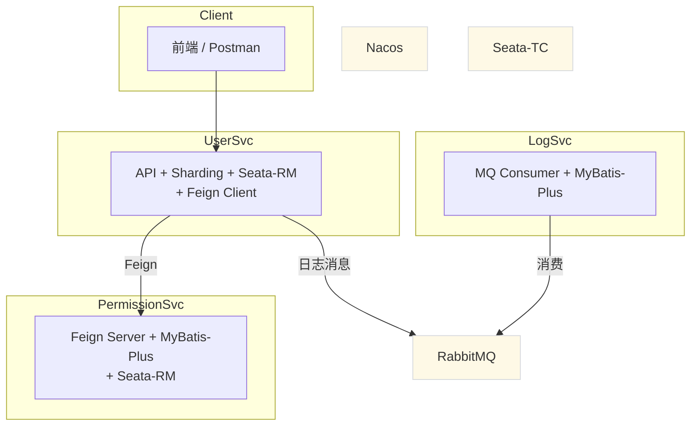
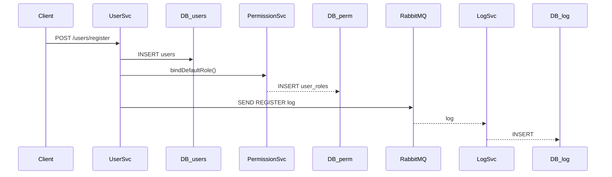
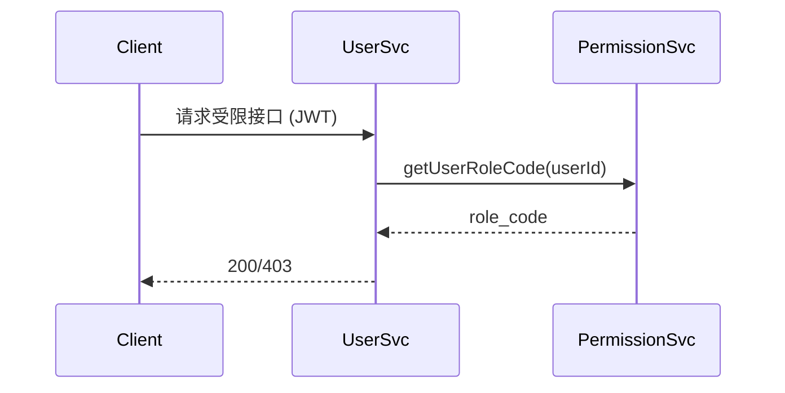

# 设计文档

> 项目：简化版用户权限管理系统
> 模块：user-service · permission-service · logging-service · common-api
> 日期：2025-06-19

---

## 1. 系统概述

本系统面向 **用户与角色管理** 场景，遵循微服务拆分原则，提供注册、登录、权限校验、操作审计等能力，核心关注点如下：

1. **角色三级分级**：普通用户 / 管理员 / 超级管理员。
2. **操作日志异步化**：统一切面采集 → RabbitMQ → 单库持久化。
3. **服务解耦**：OpenFeign + Nacos 实现 RPC 与配置中心。
4. **分库分表**：用户表按雪花 `user_id` 取模做 **仅分库** 水平拆分（每库单表 `users`）。
5. **分布式事务**：注册过程采用 **Seata-AT** 保障 `users` + `user_roles` 原子一致。

---

## 2. 微服务划分

| 服务               | 端口 | 主要职责                               | 关键依赖                                                    |
| ------------------ | ---- | -------------------------------------- | ----------------------------------------------------------- |
| user-service       | 8082 | 用户注册 / 登录 / 用户 CRUD / 日志发送 | Spring Boot · ShardingSphere-JDBC · Seata-RM · OpenFeign |
| permission-service | 8081 | 角色绑定 / 查询 / 升降级               | Spring Boot · MyBatis-Plus · Seata-RM                     |
| logging-service    | 8083 | MQ 消费 & 操作日志落库                 | Spring Boot · RabbitMQ                                     |
| common-api         | —   | 公共工具库 / Feign 接口 / 常量         | Spring Boot Starter Module                                  |

> 服务注册、配置及事务协调统一由 **Nacos + Seata TC (cluster)** 提供支持。

---

## 3. 技术栈

* Spring Boot 3.1.x / Spring Cloud 2022.x / Spring Cloud Alibaba 2022.x
* OpenFeign (HTTP RPC)
* ShardingSphere-JDBC 5.4.1（库级水平分片 + Seata-AT 插件）
* MyBatis-Plus 3.5.x
* RabbitMQ 3.x（direct 交换机）
* Seata 2.0 （AT 模式、Nacos 注册）

---

## 4. 核心设计

### 4.1 架构图



### 4.2 数据库表

1. **users**（分库）`user_id PK · username UNIQUE · password · email · phone · gmt_create`
2. **roles**（权限库，静态三条）`role_id {1,2,3} · role_code {super_admin,user,admin}`
3. **user_roles**（权限库）`id PK · user_id · role_id ⟂ UNIQUE(user_id)`
4. **operation_logs**（日志库）
   `log_id PK · user_id · action · ip · detail TEXT`

### 4.3 分库规则

```yaml
# sharding.yaml（摘录）
tables:
  users:
    actualDataNodes: ds${0..1}.users     # 只分库不分表
    databaseStrategy:
      standard:
        shardingColumn: user_id
        shardingAlgorithmName: users_database_inline

shardingAlgorithms:
  users_database_inline:
    type: INLINE
    props:
      algorithm-expression: ds${user_id % 2}
```

### 4.4 全局事务

```java
@GlobalTransactional // 用户注册
public UserLoginVO register(RegisterFormDTO dto){
  saveUser();                    // user_db_x
  permissionService.bindDefaultRole(id);  // permission-db
}
```

Seata-AT 拦截两次本地事务，TC 协调回滚 / 提交。

### 4.5 日志切面 & MQ

```java
@Around("@annotation(OpLog)")
public Object around(...){
  rabbitTemplate.convertAndSend("log.direct", "", log);
}
```

LogSvc 监听 `log.direct` → batch insert；消息失败自动重试 + 死信。

---

## 5. 关键流程

### 5.1 注册流程



### 5.2 权限校验



---

## 6. 接口摘要

| 服务               | 方法 & 路径                      | 说明                           |
| ------------------ | -------------------------------- | ------------------------------ |
| user-service       | POST `/users/register`         | 注册 + 事务 + 日志             |
|                    | POST `/users/login`            | 登录获取 JWT                   |
|                    | GET `/users`                   | 列表（按角色过滤）             |
| permission-service | PUT `/Permission/{id}`         | 绑定默认角色                   |
|                    | PUT `/Permission/upgrade/{id}` | 升级管理员                     |
| logging-service    | —                               | MQ 监听，无暴露接口            |
| common-api         | —                               | 公共工具库 / Feign 接口 / 常量 |

---

## 7. 部署要点

1. **Docker Compose** 启动外部依赖（MySQL×4 / Nacos / RabbitMQ / Seata）。
2. `mvn clean package -DskipTests` 后依次启动 `logging-service → permission-service → user-service`。
3. 所有配置（DB、Nacos 地址等）在 `nacos:<shared-*.yaml>` 中集中管理，可热更新。

---

> 文档仅保留与评审指标强相关信息；流程图由 Mermaid 生成，存稿为 `diagram/`. 对应测试结果请参见《自测报告》。
