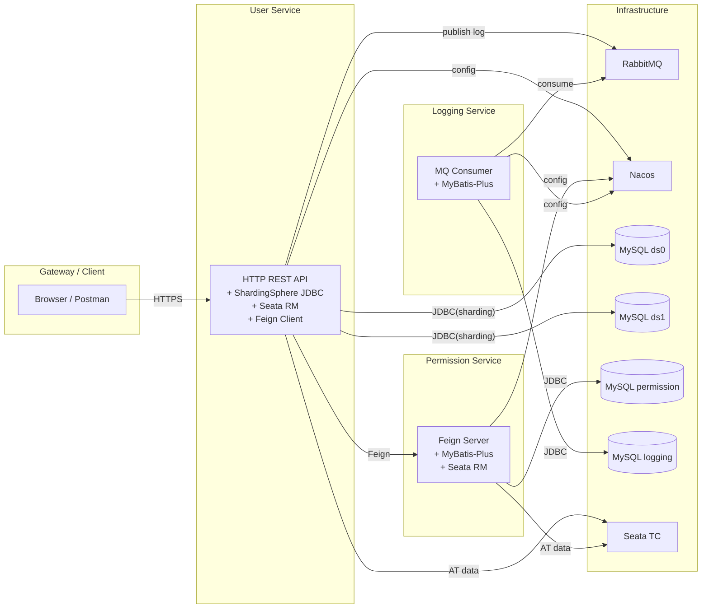
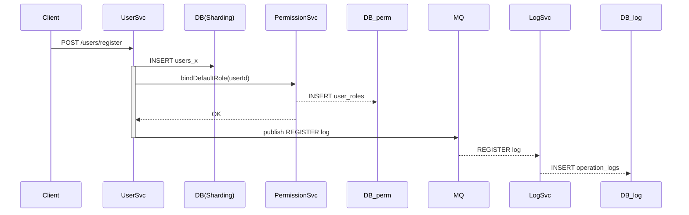
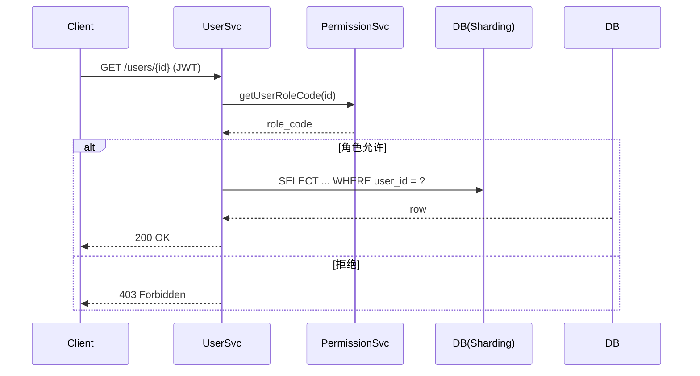

# 简化版用户权限管理系统文档

> 基于现有代码（`user-service / permission-service / logging-service`）整理  
> 请将本文件放入「文档」目录直接提交  

---

## 1. 项目目标

* 普通用户 / 管理员 / 超级管理员三级角色  
* 操作日志异步写库（MQ）  
* 微服务解耦（Feign + Nacos 注册发现）  
* 用户表水平分片（ShardingSphere）  
* 注册流程采用 Seata 全局事务保证 **用户 → 角色绑定** 原子性  

---

## 2. 总体架构

（点击可放大）


> 生成自 Mermaid：  


---

## 3. 服务设计  

| 服务                   | 端口 | 关键依赖                                          | 主要职责                              |
| ---------------------- | ---- | ------------------------------------------------- | ------------------------------------- |
| **user-service**       | 8082 | Spring Boot, ShardingSphere-JDBC, Feign, Seata-RM | 用户注册/登录、用户查询、操作日志发送 |
| **permission-service** | 8081 | Spring Boot, MyBatis-Plus, Feign Server, Seata-RM | 角色绑定、角色查询、升级/降级         |
| **logging-service**    | 8083 | Spring Boot, RabbitMQ, MyBatis-Plus               | MQ 消费并持久化操作日志               |

### 3.1 User Service  

#### REST 接口一览

| Path                    | Method | 描述           | 权限说明                             |
| ----------------------- | ------ | -------------- | ------------------------------------ |
| `/users/register`       | POST   | 用户注册       | 公开                                 |
| `/users/login`          | POST   | 登录并返回 JWT | 公开                                 |
| `/users`                | GET    | 分页列表       | 普通：自己；管理员：普通；超管：全部 |
| `/users/{userId}`       | GET    | 查询单个       | 同上                                 |
| `/users/{userId}`       | PUT    | 修改信息       | 普通：自己；管理员：普通；超管：全部 |
| `/users/reset-password` | POST   | 重置密码       | 同上                                 |

> API 示例（摘自代码）
```http
POST /users/register
Content-Type: application/json

{
  "username": "foo",
  "password": "123456",
  "email": "foo@bar.com",
  "phone": "18888888888"
}
```

#### 重要实现点  
* **分片路由** `sharding.yaml`  
  ```yaml
  actualDataNodes: ds${0..1}.users_${0..1}
  algorithm-expression: ds${user_id % 2}      # 路由库
  algorithm-expression: users_${user_id % 2}  # 路由表
  ```
* **全局事务**  
  ```java
  @GlobalTransactional   // Seata AT
  public UserLoginVO register(RegisterFormDTO dto) { ... }
  ```
* **日志切面** `OpLogAspect`  
  成功 / 失败统一 `rabbitTemplate.convertAndSend("log.direct", "", operationLog);`

### 3.2 Permission Service  

#### RPC 接口  
```java
@FeignClient(name = "permission-service", path = "/Permission")
public interface PermissionService {

  @PutMapping("/{userId}")
  void bindDefaultRole(@PathVariable Long userId);

  @GetMapping("/{userId}")
  String getUserRoleCode(@PathVariable Long userId);

  @PutMapping("/upgrade/{userId}")
  void upgradeToAdmin(@PathVariable Long userId);

  @PutMapping("/downgrade/{userId}")
  void downgradeToUser(@PathVariable Long userId);
}
```

#### 角色绑定逻辑  
```java
@Transactional      // 与 user-service 全局事务协作
public void bindDefaultRole(Long userId){ ... }   // 默认 role_id = 2
```

### 3.3 Logging Service  

* 监听 `log.direct` 交换机  
* 反序列化 `OperationLog` → MySQL  
* 幂等策略：以 `logId` 做唯一键

---

## 4. 数据库设计  

### 4.1 用户分片库  

```
user_db_0.users_0 / users_1
user_db_1.users_0 / users_1
```

| 字段          | 类型         | 说明     |
| ------------- | ------------ | -------- |
| user_id       | BIGINT PK    | 雪花主键 |
| username      | VARCHAR(50)  | 唯一索引 |
| password      | VARCHAR(255) | 加密存储 |
| phone / email | …            |          |
| gmt_create    | TIMESTAMP    | 创建时间 |

### 4.2 权限库  

见题干表结构。

### 4.3 日志库  

见题干表结构。

---

## 5. 关键流程  

### 5.1 注册（全局事务 + 异步日志）



### 5.2 用户信息查询（权限校验 + 分片路由）



---

## 6. 技术难点与解决  

| 难点                   | 方案                                                         |
| ---------------------- | ------------------------------------------------------------ |
| 分片取模报 *not match* | 保证 `algorithm-expression` 与实际数据源命名一致；`user_id` 参与取模必须为 **Long**（代码已在 `selectUser` 做类型转换） |
| 分布式事务一致性       | Seata AT 模式 + 两个 RM（user / permission）。注册接口标记 `@GlobalTransactional`，异常时回滚两边数据 |
| MQ 消息可靠            | 开启 **publisher confirmations**；消费端手动 ACK，失败重试（或投递死信队列） |
| 超级管理员初始化       | `SuperAdminInitializer` 启动时检测 `users` / `roles` 表，无则写入默认超管 |
| 权限校验复杂           | 统一放到 `UserServiceImpl` 内部：取当前角色 + 目标角色进行 switch / if 权限判断 |

---

## 7. 自测步骤

1. `docker-compose up` 启动 **MySQL ×3 / Nacos / RabbitMQ / Seata-Server**  
2. 依次启动三个 Spring Boot 微服务  
3. `POST /users/register` 注册 → 查看 `user_db_x` / `user_roles` / `operation_logs` 均有数据  
4. 使用返回的 `token` 调用其它接口验证权限分支  
5. 手工制造异常（如重复用户名）→ 确认用户表与角色表均未写入（验证 Seata 回滚）  
6. 修改 `sharding.yaml` 中表达式，验证分片路由  

---

## 8. 评分点对照  

| 评分类目         | 说明                          | 状态 |
| ---------------- | ----------------------------- | ---- |
| 功能实现         | 注册/登录/权限/日志           | ✅    |
| 日志打印         | `OpLogAspect` & Slf4j         | ✅    |
| 分库分表         | `users` 水平分片              | ✅    |
| RPC + 分布式事务 | Feign + Seata                 | ✅    |
| 消息队列         | RabbitMQ 异步日志             | ✅    |
| 文档             | **本文件** + Mermaid 图       | ✅    |
| 其他亮点         | JWT鉴权、统一异常、全链路日志 | ✅    |

---

## 9. 目录 & 提交示例  

```
张三_XX大学_后端/
├── 后端代码.zip   # user-service / permission-service / logging-service
└── 文档/
    ├── 设计文档.md   # (即本文件)
    ├── 架构图.png    # 可截图 Mermaid 渲染图
    └── 自测记录.md
```

> **注意**：`后端代码.zip` 内必须是三个独立 Spring Boot 项目；压缩格式必须 `.zip`。  

